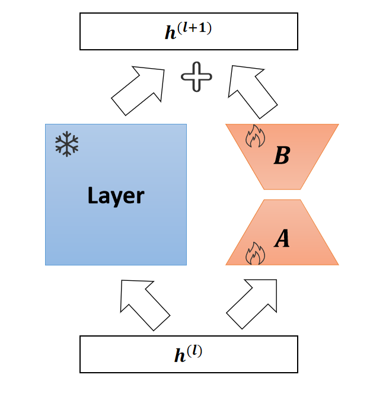

# LoR2C: Low-Rank Residual Connection Adaptation for Parameter-Efficient Fine-Tuning
LoR2C (Low-Rank Residual Connection Adaptation) is a residual connection that is parallelly attached to layers in a stacked structure. Introducing LoR2C helps mitigate gradient vanishing while fine-tuning the activation vectors of each layer, achieving better performance with fewer parameters.

## Method Overview
<div align=center> 

</div> 

## Quickstart
1. Install dependencies

   ```bash
   conda create -n LoR2C python=3.10
   conda activate LoR2C
   pip install torch==2.0.1
   pip install -r requirements.txt
   ```

   ```bash
   cd peft-0.5.0
   pip install -e .
   ```

2. Run experiments

fill in the `--model_name_or_path` `--wandb_project` and `--output_dir` in `llama_finetune.sh` and `glue_finetune.sh` with the path to the model and the output directory.

### Instruction Tuning
```bash
bash llama_finetune_lor2c.sh
```

### NLU

```bash
bash glue_finetune_lor2c.sh
```
## Thanks

Code is largely based on [AGI-Edgerunners/LLM-Adapters](https://github.com/AGI-Edgerunners/LLM-Adapters), [huggingface/peft](https://github.com/huggingface/peft), [huggingface/transformers](https://github.com/huggingface/transformers)

## Cite
If you find this method or code useful, please cite
~~~
@article{melora,
  title={Low-Rank Residual Connection Adaptation for Parameter-Efficient Fine-Tuning},
  author={Zhao, Jiancheng and Yu, Xingda and Yang, Zhen},
  booktitle={2025 International Joint Conference on Neural Networks (IJCNN)}
  year={2025}
}
~~~
